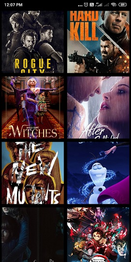
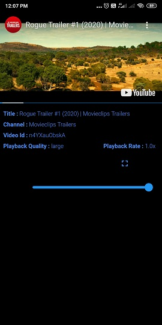

# trailerly

A flutter application to watch trailers of currently playing movies
 I used tmdb API to get movies list. 
 Youtube search API to get the trailer video id  
 Youtube_player_flutter to play youtube videos.
 <a href="url">https://pub.dev/packages/youtube_player_flutter</a>
     
 Not much work done on the UI part.

<b> How to use </b>
     Get tmdb api key and paste in the movies file link.
      Get the google api key and paste in movies data file link.

 Home Screen displaying the movies in grid
  
 
 
 
 
 

 Video screen to play the trailer
 
 

